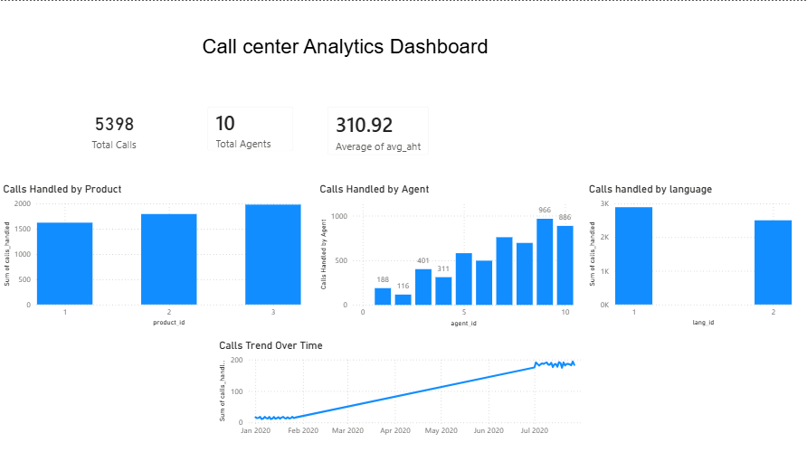

# 📞 Call Center Analytics Dashboard

## Project Overview

This project simulates a real-world call center analytics assignment. The goal is to analyze customer service operations, identify performance trends, and provide business recommendations using SQL, Excel, and Power BI.
## Dashboard Preview


---

## Business Problem

The Operations Manager has requested answers to the following questions:

- How many calls are handled each month?
- Which agents have the highest performance?
- What is the average handling time?
- What is the average customer satisfaction (CSAT) score?
- What is the First Call Resolution (FCR) rate?
- Which call reasons are most common?

---
## Key Insights

- Total Calls: 5,398
- Average Handling Time (AHT): 310.92 seconds
- Total Agents: 10
- Product 3 handled the highest number of calls.
- Agent 9 handled the highest call volume.
- Language 1 received more calls than Language 2.
- --
Business Recommendations

- Review why Product 3 generates the highest call volume and identify common customer issues.
- Analyze Agent 9's workflow to identify best practices that can be shared with other agents.
- Allocate more resources to support customers using Language 1.
- Continue monitoring Average Handling Time to improve operational efficiency and customer experience.
---
## Tools Used

- SQL
- Microsoft Excel
- Power BI
- GitHub

---

## Repository Structure

```
Data/
Images/
PowerBI/
SQL/
README.md
```

---

## Project Status
✅  Portfolio Project Completed
